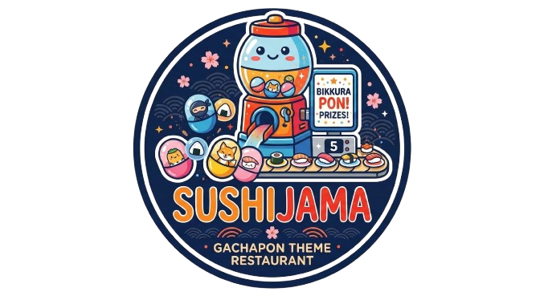
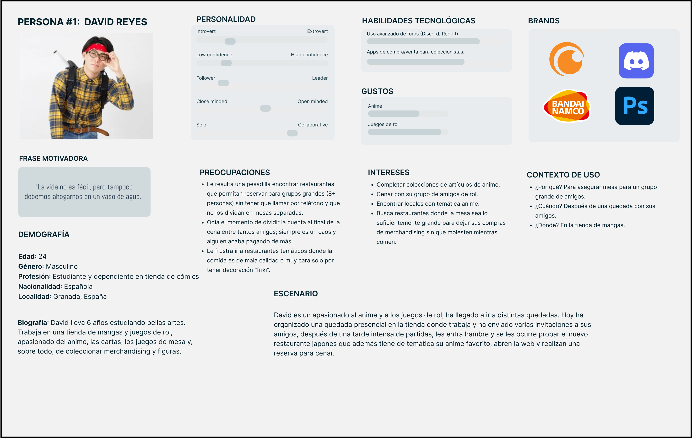
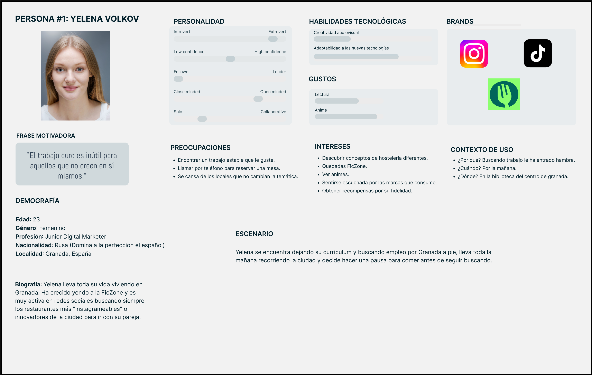
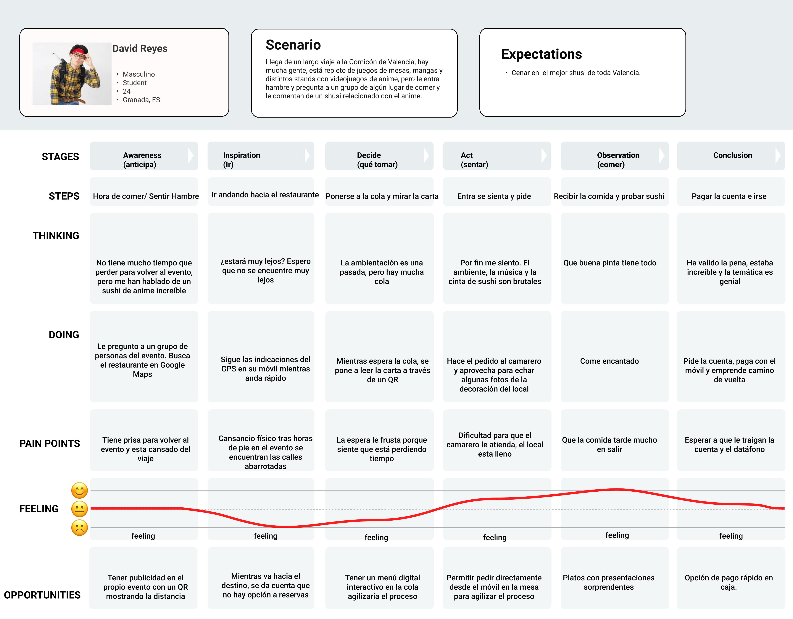
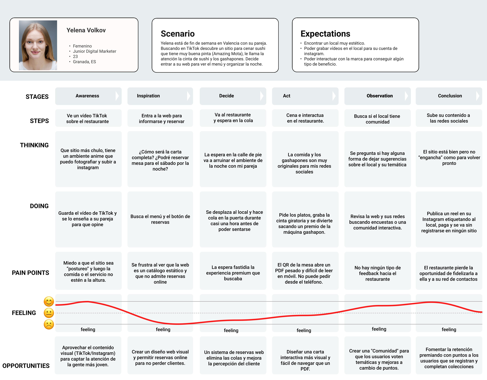

# DIU - Practica1 (Entregables)

## Paso 1. UX User & Desk Research & Análisis 

### 1.a User Research Plan
-----

Para comenzar a hacer el User Research Plan de nuestro proyecto SushiJAMA hemos visitado y degustado otros restaurantes japoneses con una temática parecida a la que tenemos ideada con la finalidad de abstraernos de lo convencional.

La investigación que hemos realizado se ha basado en identificar los posibles puntos débiles de otros restaurantes para conseguir adaptar la comida japonesa tradicional a las nuevas tendencias, para ello nos hemos basado en patrones de consumo y opiniones/reseñas de distintos usuarios en redes sociales buscando siempre la novedad.

SushiJAMA se diferencia del resto de locales con una nueva mecánica que consiste en una recompensa ambientada en la temática que haya en ese momento. Esta, consiste en un gashapon de pequeños premios aleatorios, que variarán por temporada cada 5 puntos adquiridos. Estos dependen del tipo de plato pedido, habiendo platos de 1,2 y 3 puntos. Con esta propuesta, queremos incentivar a que los usuarios quieran coleccionar todos los premios de esa temporada. Además habrá una recompensa adicional para quienes tengan toda la colección.

Para hacer esto posible, nos centraremos en que el público usuario sea participe del progreso del restaurante aportando sus propuestas de mejora e ideas para futuras temporadas.

  

### 1.b Competitive Analysis
-----

Para nuestro análisis competitivo, hemos seleccionado dos modelos de negocio parecidos al nuestro que nos permiten evaluar cómo se gestiona la experiencia de usuario frente al sistema de recompensas:

* **[Amazing Mota](https://www.amazingmota.com/welcome) (Valencia):** Un restaurante buffet local muy popular por incluir una cinta giratoria y máquinas de Gashapon físicas.
* **[Kura Sushi](https://kurasushi.com/) (Internacional):** Es una cadena global pionera en la integración de recompensas mediante su sistema *Bikkura Pon*.

Hemos elegido estas dos plataformas porque representan los dos extremos del mercado al que nos dirigimos. Por un lado, Amazing Mota tiene un gran atractivo físico, pero su carencia total de reservas online y de un seguimiento digital de los premios genera algo de fricción al usuario. Por otro lado, Kura Sushi ofrece un ecosistema digital robusto, pero su interacción es puramente unidireccional (el usuario consume y recibe, sin formar parte de una comunidad). 

Realizar esta comparativa nos aporta información vital para **SushiJAMA**, mostrando que existe un nicho desatendido para una plataforma que combine un portal de *delivery* con un perfil de usuario gamificado (*Pakupaku-Go*) donde el progreso se guarde digitalmente y la comunidad participe en las decisiones del restaurante.

A continuación, mostramos la matriz de análisis donde hemos evaluado aspectos de modelo de negocio, funcionalidad, usabilidad y accesibilidad:

### 1.c Personas 
-----
Presentamos dos perfiles diferentes, donde cada uno aporta su visión y expectativas desde perspectivas distintas, pero con el objetivo común de disfrutar de una experiencia gastronómica única y sin complicaciones. David es un chico más reflexivo e introvertido, un coleccionista apasionado por el anime y los juegos de rol que valora la eficiencia y busca asegurar la mesa para sus amigos sin tener que hacer colas. Yelena, por otro lado, es una líder extrovertida y creativa, experta en marketing digital, que siempre busca locales innovadores e "instagrameables" para compartir contenido e interactuar con la comunidad de sus marcas favoritas.
 

### 1.d User Journey Map
----

David y Yelena se enfrentan a la experiencia de visitar un restaurante de la competencia (Amazing Mota) desde perspectivas muy diferentes. Para David, la salida representa una oportunidad para disfrutar con sus amigos de rol y ampliar su colección de figuras, pero la imposibilidad de reservar online y las largas esperas en la calle dificultan enormemente su experiencia. A pesar de disfrutar de la comida y el premio físico, la falta de un perfil digital para guardar su progreso le resulta frustrante. Por su parte, Yelena busca un local estético para crear contenido e interactuar con la marca. Aunque el ambiente visual le resulta muy atractivo, la pobre digitalización del menú y la ausencia total de una comunidad online donde participar o dejar sugerencias acaban frustrando por completo su experiencia.
 
 
 

### 1.e Usability Review
----

La página de **SushiJAMA** ha obtenido una puntuación de **79 sobre 100** (Buena).
 
 
 

En nuestra revisión, SushiJAMA demuestra ser una plataforma sólida y bien planteada. Destaca especialmente en la claridad de su contenido, la arquitectura de la información y la facilidad para que los usuarios comprendan el innovador sistema de recompensas gamificado. La identidad visual es atractiva y está muy bien alineada con nuestro público objetivo.

Sin embargo, para alcanzar la excelencia y superar a competidores físicos como Amazing Mota o Kura Sushi, hemos detectado áreas de mejora clave. Existen ciertas fricciones en el flujo de la reserva online que podrían simplificarse para reducir el número de clics, y las opciones de filtrado en el menú digital pueden resultar algo confusas en dispositivos móviles. Optimizar la navegación en estos puntos es crucial para redondear la experiencia del usuario.

Enlace: [Aquí](./5.UsabilityReview/UsabilityReview_SushiJAMA.xlsx).

### 1.f Briefing Final
----

Como se indicó inicialmente en el [User Research](#1a-user-research-plan), el objetivo de nuestro proyecto SushiJAMA es revolucionar la experiencia en la restauración japonesa, uniendo la reserva online con un sistema de fidelización (Pakupaku-Go).

Para asentar las bases, iniciamos haciendo un [Análisis de competidores](#1b-competitive-analysis), destacando el caso de [Amazing Mota](https://www.amazingmota.com/welcome). Concluimos que, aunque su modelo físico con gashapones y cinta giratoria es muy atractivo para el público, presenta una gran carencia: no admiten reservas online y su menú es un simple PDF estático, lo que genera fricción en la experiencia del usuario incluso antes de visitar el local.

Después, valoramos esta [experiencia](#1d-user-journey-map) a través de dos [perfiles](#1c-Personas) con intereses distintos. Por un lado, David, un usuario coleccionista que buscaba organizar una cena con amigos, se encontró con el estrés de hacer cola en la calle y la frustración de no poder registrar digitalmente sus premios físicos. Por otro lado, Yelena, una creadora de contenido que buscaba interactuar con la marca, se topó con un sistema sin opciones para dejar feedback o participar en una comunidad.

Finalizamos con una revisión de [usabilidad](#1e-usability-review) del sitio, obteniendo una puntuación de 79/100. Valoramos positivamente aspectos como la estructura visual y la claridad del menú principal, pero detectamos algunos fallos como una barra de búsqueda mejorable, posibles errores en la navegación y las citas del apartado de reservas así como la falta de opciones de filtrado.

En conclusión, el estudio confirma que existe un nicho claro para SushiJAMA. Para triunfar, es necesario diseñar una plataforma *web responsive* que elimine las colas mediante reservas online, ofrezca una carta interactiva y fidelice al usuario permitiéndole gestionar sus puntos de gashapon y votar en las decisiones futuras del restaurante.
