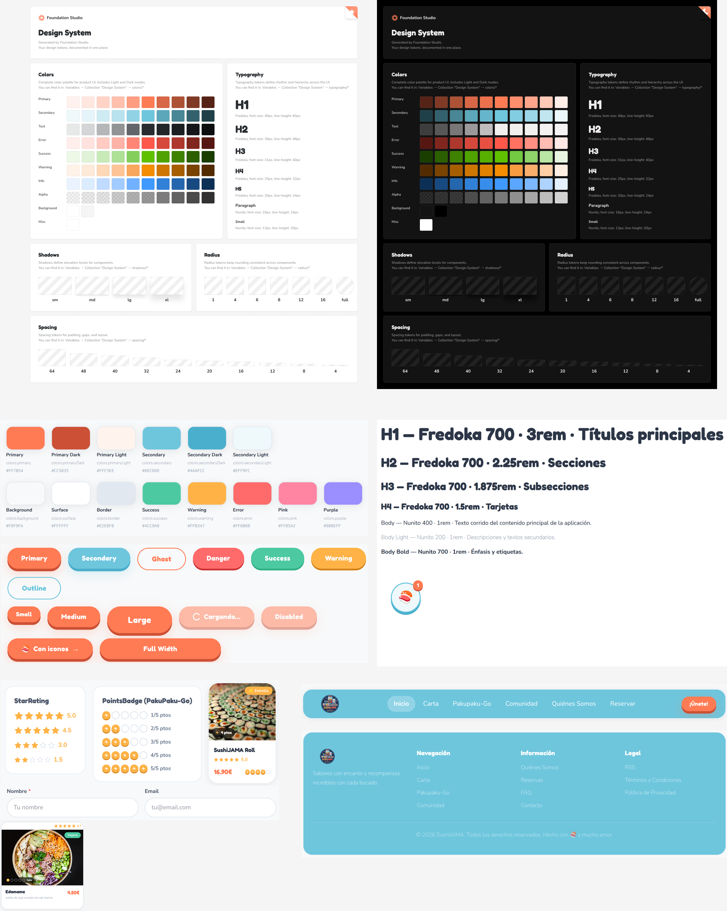
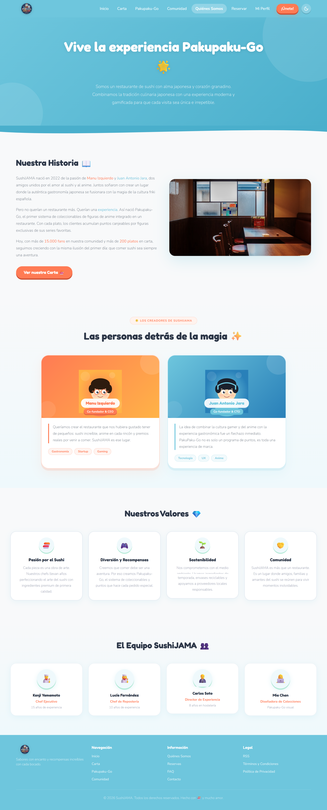
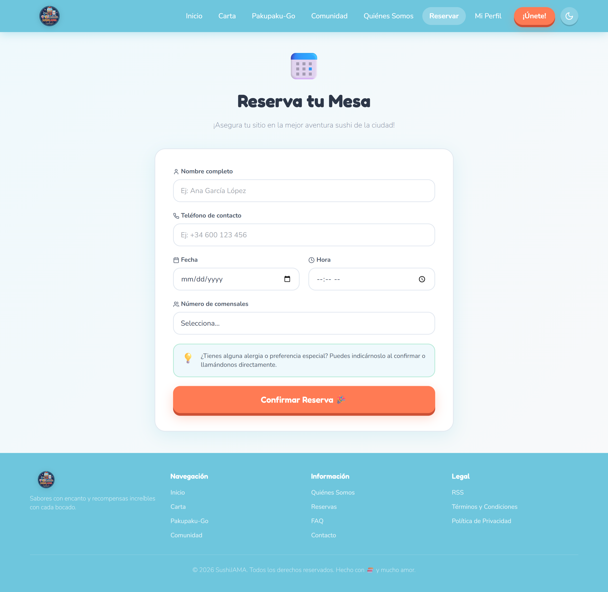
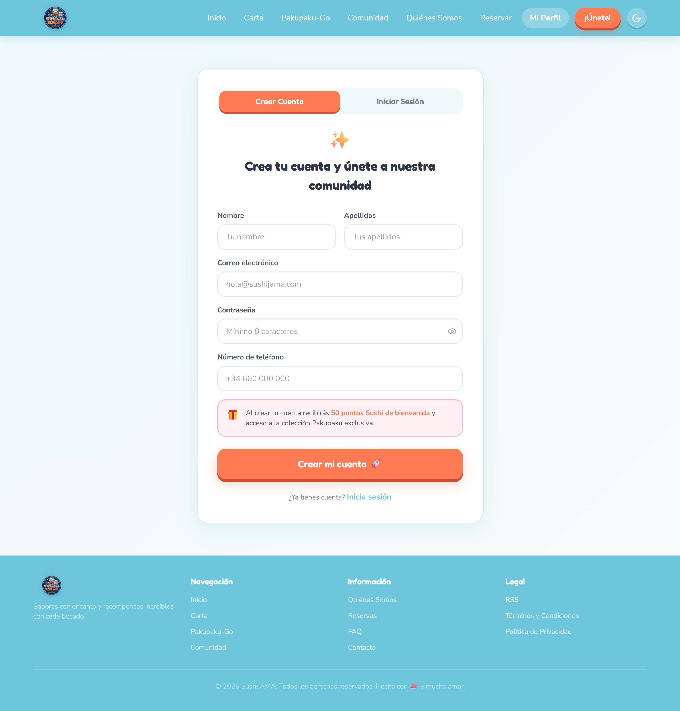

# DIU - Práctica 3: Prototipado / Mockup

**Proyecto:** SushiJAMA  
**Centro:** ETSIIT — Universidad de Granada  
**Curso:** 2025-2026  
**Equipo:** Manuel Jesús Izquierdo, Juan Antonio Jara

---

## 1. Moodboard

El diseño visual de SushiJAMA fusiona la gastronomía japonesa con la estética Kawaii y la cultura de coleccionables de anime. La paleta combina el coral `#FF7B54` como color de acción con el teal `#6EC6DD` como color de equilibrio, generando una identidad fresca y reconocible. Para tipografía se eligió **Fredoka** en titulares, por su carácter geométrico y amigable, junto a **Nunito** para el cuerpo de texto por su legibilidad en pantalla. El imagotipo representa una máquina Gashapon con elementos de sushi, reforzando visualmente la mecánica de recompensa del sistema PakuPaku-Go.

---

## 2. Landing Page

Página de aterrizaje orientada al onboarding de nuevos usuarios. Incluye un hero con el headline *"Donde cada bocado es un premio"*, sección de beneficios, explicación del sistema PakuPaku-Go en cuatro pasos y un CTA final de conversión. El diseño se desarrolló con herramientas de diseño asistido por IA para la generación de la estructura base, refinando manualmente los componentes para integrarlos en el sistema de diseño.

---

## 3. Design System

Sistema de diseño ligero basado en **Atomic Design**, generado con el plugin **Foundation Studio** de Figma. Los componentes van desde átomos (botones, inputs, StarRating) hasta organismos completos (navbar, footer, tarjetas de platos).

---

## 4. Layout Hi-Fi

Pantallas de alta fidelidad que cubren el flujo completo del cliente, conectadas mediante prototipo interactivo en Figma con transiciones Smart Animate.

| Pantalla | Descripción |
|---|---|
| **Landing** | Onboarding y presentación de la propuesta de valor |
| **Carta** | Menú por categorías con valoraciones, precios y puntos PakuPaku |
| **PakuPaku-Go** | Dashboard personal de coleccionables y progreso de temporada |
| **Comunidad** | Galería social bajo el hashtag #SushiJAMAFans |
| **Quiénes Somos** | Historia, fundadores, valores y equipo |
| **Reservar** | Formulario de reserva de mesa |
| **Crear Cuenta** | Registro gamificado con incentivo de 50 puntos de bienvenida |

---

## 5. Briefing

El principal reto del proyecto fue integrar las mecánicas de gamificación sin sobrecargar visualmente la pantalla del usuario. Partimos de un Design System sólido que agilizó el proyecto con componentes reutilizables en Figma, de esta manera cualquier ajuste se propagaba automáticamente a todas las pantallas facilitando la creación del Hi-Fi.
Tuvimos que dar varios pasos atrás y simplificar, dejando la gamificación como algo que aparece de forma sutil en las pantallas del sitio web (los puntos en la carta, colección de figuras) y concentrando todo lo lúdico en la pantalla de PakuPaku-Go.
