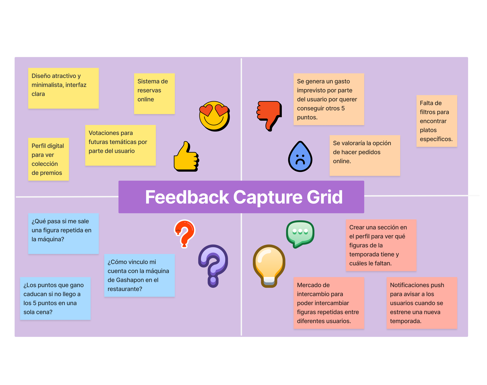
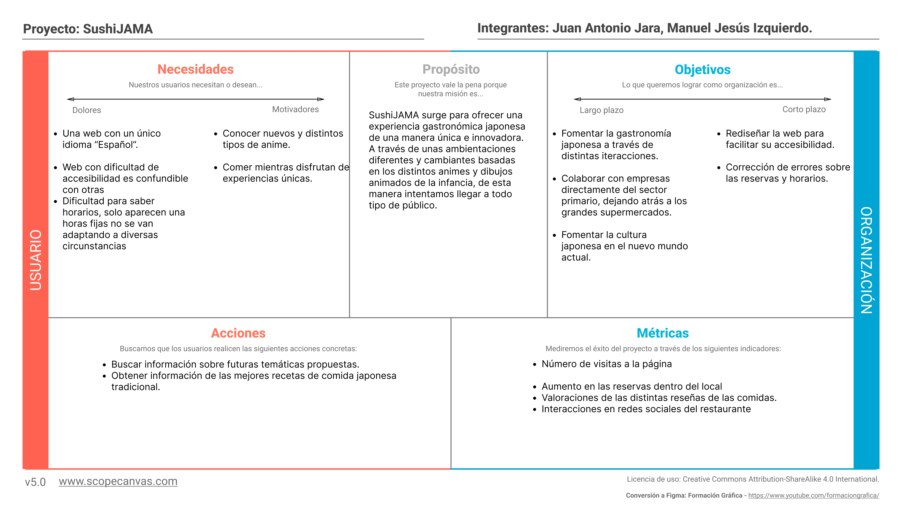
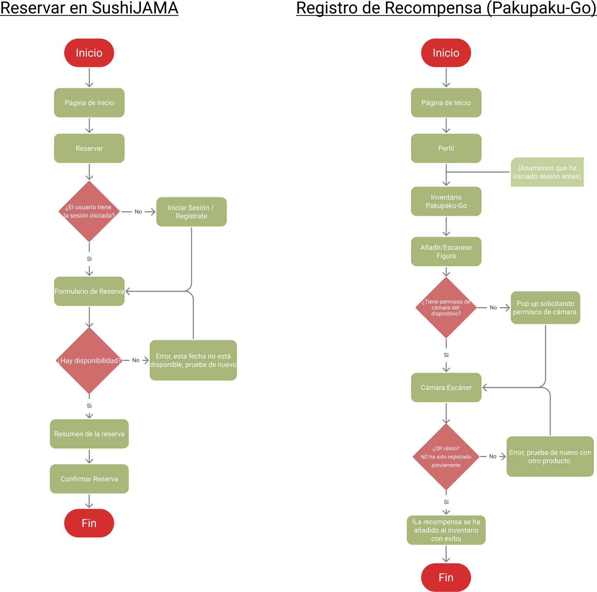
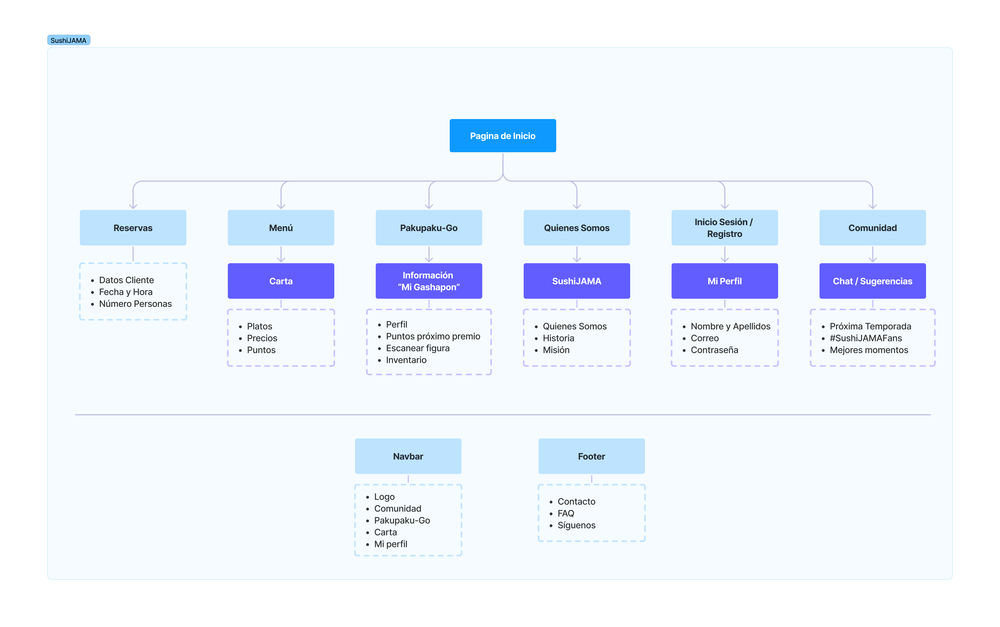
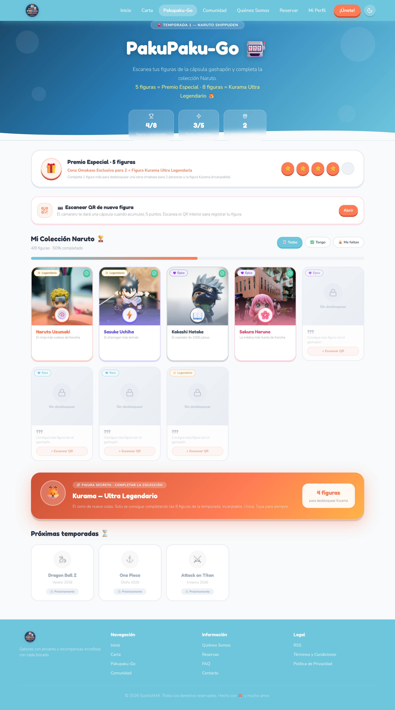
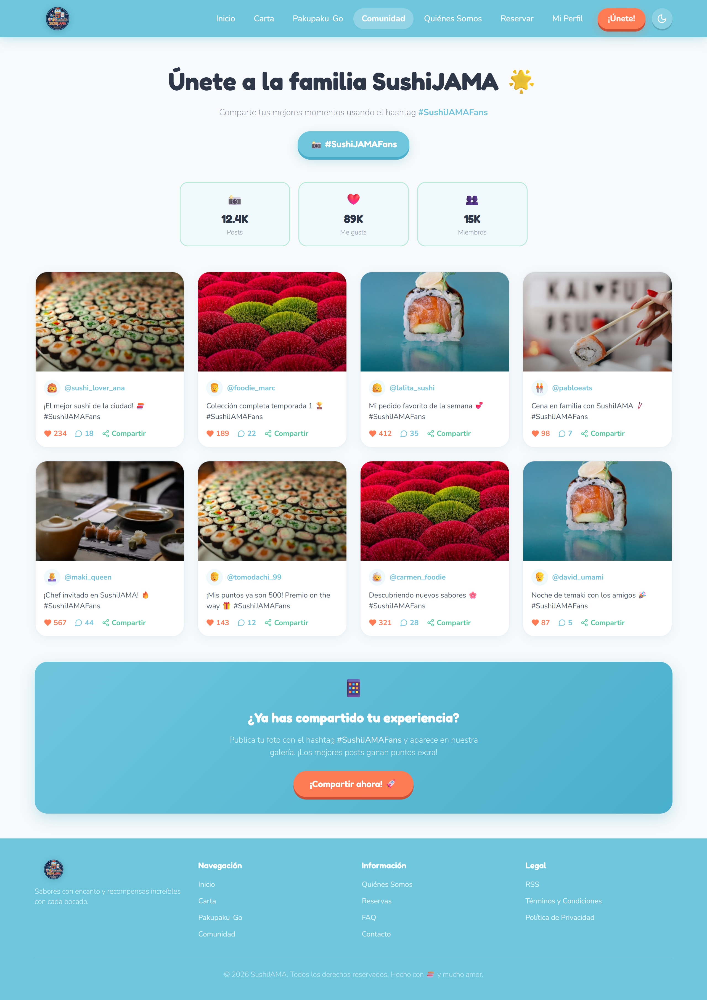

# DIU26 — SushiJAMA
**Prácticas Diseño de Interfaces de Usuario** · Restaurante Sushi Temática Anime

**Grupo:** DIU1_SushiJAMA · **Curso:** 2025/26  
**Equipo:**
- :bust_in_silhouette: Juan Antonio Jara · [:octocat: juaantt123](https://github.com/juaantt123)
- :bust_in_silhouette: Manuel Jesús Izquierdo · [:octocat: manu-izquierdo](https://github.com/manu-izquierdo)

---

## Proyecto: SushiJAMA

SushiJAMA es un restaurante japonés de temática anime que combina la gastronomía japonesa con un sistema de recompensas físicas mediante Gashapones. A través de la plataforma web, los usuarios acceden a **PakuPaku-Go**, un sistema de fidelización donde cada plato consumido otorga 1, 2 o 3 puntos según su categoría. Al acumular 5 puntos, el cliente consigue un premio aleatorio de la colección temática de esa temporada. Quienes reúnan todos los premios de una colección obtienen una recompensa final exclusiva. El progreso se gestiona desde el perfil del usuario, desde donde también pueden interactuar con la comunidad y votar las temáticas de futuras temporadas.

  

---

## Proceso de Diseño

### [Práctica 1 · UX Research](./P1/README.md)

Analizamos el mercado de restaurantes japoneses con mecánicas de recompensa física para identificar el nicho de SushiJAMA. Estudiamos dos competidores representativos: **Amazing Mota** (fuerte atractivo físico pero sin digitalización) y **Kura Sushi** (ecosistema digital robusto pero sin comunidad). Construimos dos personas ficticias —David, coleccionista introvertido, y Yelena, creadora de contenido— y mapeamos su experiencia en el competidor, detectando las fricciones que SushiJAMA debe resolver. La revisión de usabilidad sobre la propuesta inicial obtuvo una puntuación de **79/100**.

| | |
|---|---|
|  |  |
|  |  |

📄 [Ver README completo P1](./P1/README.md)

---

### [Práctica 2 · UX Design](./P2/README.md)

Partiendo de los hallazgos de la P1, definimos la propuesta de valor de SushiJAMA mediante malla receptora de información, mapa de empatía y análisis POV. El ScopeCanvas concretó los objetivos a corto plazo (reservas online y carta interactiva) y a largo plazo (comunidad y coleccionismo digital). Diseñamos los flujos de usuario para las dos tareas críticas —reserva de mesa y registro de figura PakuPaku-Go— y estructuramos la arquitectura de información en un Sitemap de 6 nodos principales con menos de 3 clics de profundidad. Finalizamos con wireframes Lo-Fi en Figma con diseño responsive Mobile-First.

| | |
|---|---|
|  |  |
|  |  |

📄 [Ver README completo P2](./P2/README.md)

---

### [Práctica 3 · Prototipado Hi-Fi](./P3/README.md)

Desarrollamos el sistema visual completo de SushiJAMA: identidad de marca con imagotipo Kawaii, paleta coral/teal, tipografías Fredoka + Nunito y un Design System ligero basado en Atomic Design generado con Foundation Studio. Diseñamos 7 pantallas Hi-Fi en Figma con transiciones Smart Animate: Landing, Carta, PakuPaku-Go, Comunidad, Quiénes Somos, Reservar y Crear Cuenta.

  

| | |
|---|---|
|  |  |
|  |  |

📄 [Ver README completo P3](./P3/README.md)

---

### [Práctica 4 · Publicación Web](./P4/readme.md)

Llevamos el diseño Hi-Fi a una web funcional y publicada, manteniendo el sistema de diseño y la identidad visual definidos en la P3. La navegación cubre el flujo completo del cliente con todas las páginas enlazadas y los formularios operativos.

🔗 **Web publicada:** [https://fix-crayon-77936773.figma.site](https://fix-crayon-77936773.figma.site)

📄 [Ver README completo P4](./P4/README.md)

---

### [Práctica 5 · Evaluación: A/B Testing y Accesibilidad](./P5/README.md)

Evaluación del prototipo con usuarios reales mediante cuestionario SUS, Eye Tracking con GazeMapping y análisis de accesibilidad WCAG. Se realizará una co-evaluación cruzada con otro grupo de clase (Caso B).

> 🚧 En desarrollo

📄 [Ver README completo P5](./P5/README.md)

---

## Conclusiones del proyecto

SushiJAMA ha supuesto un recorrido completo por la metodología UX: desde identificar un nicho real en el mercado de restauración japonesa hasta publicar una web funcional que lo materializa. Lo más valioso del proceso fue comprobar que las decisiones tomadas en las primeras fases —especialmente la arquitectura de información y el Design System— tienen un impacto directo en la velocidad y coherencia de todo lo que viene después. El sistema PakuPaku-Go, que parecía un añadido complejo al principio, acabó siendo el elemento que más diferencia al proyecto y el que más interés genera en los usuarios con los que hemos hablado.
